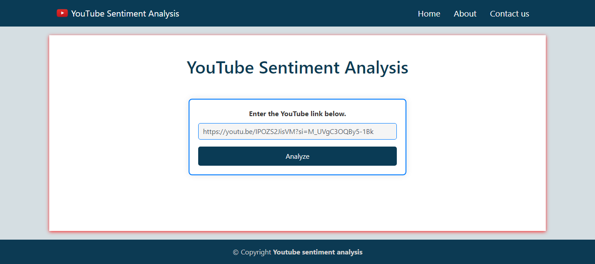
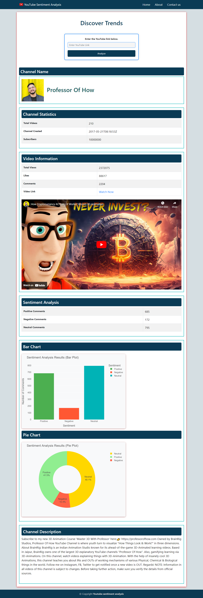

# YouTube Sentiment Analysis Web App 🎥💬📊

This web application performs sentiment analysis on YouTube video comments. It utilizes Flask for the web framework, NLTK for sentiment analysis, and Plotly for data visualization. The YouTube Data API is used to retrieve video information and comments.





## Setup ⚙️

1. Install the required dependencies using the following command:

    ```bash
    pip install -r requirements.txt
    ```

2. Obtain a YouTube Data API key from the [Google Cloud Console](https://console.cloud.google.com/).

3. Replace the placeholder in `YoutubeCommentScrapper.py` with your YouTube Data API key:

    ```python
    DEVELOPER_KEY = "YOUR_API_KEY"
    ```

4. Run the Flask application:

    ```bash
    python app.py
    ```

5. Open your web browser and go to [http://127.0.0.1:5000/](http://127.0.0.1:5000/) to use the application.

## Files and Directories 📂

- **app.py:** Main Flask application file.
- **Senti.py:** Module for extracting video ID, performing sentiment analysis, and other related functions.
- **YoutubeCommentScrapper.py:** Module for saving video comments to a CSV file, getting channel information, and retrieving video statistics.
- **static/:** Directory for static files such as CSS, JavaScript, and images.
- **templates/:** Directory for HTML templates used by Flask.

    ```bash
    YouTubeSentimentAnalysis/
    │
    ├── app.py
    ├── Senti.py
    ├── YoutubeCommentScrapper.py
    ├── static/
    │   ├── css
    │   └── images
    ├── templates/
    │   ├── index.html
    ├── venv/
    ├── requirements.txt
    ├── .gitignore
    ├── LICENSE
    └── README.md

    ```

## Usage 🚀

1. Enter a valid YouTube video link in the provided form.
2. Click the "Analyze" button to retrieve and analyze video comments.
3. View channel information, video statistics, and sentiment analysis results.
4. Visualize sentiment analysis results with bar and pie charts.

## Acknowledgments 🙌

- The web application uses the Flask web framework, NLTK for sentiment analysis, and Plotly for data visualization.
- Special thanks to the developers of the Google API Python client library.

## License 📄

This project is licensed under the [MIT License](LICENSE).
